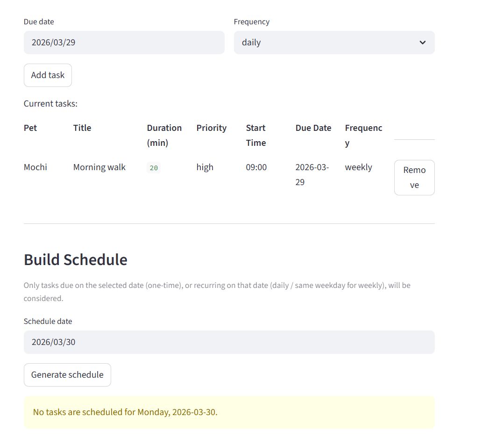
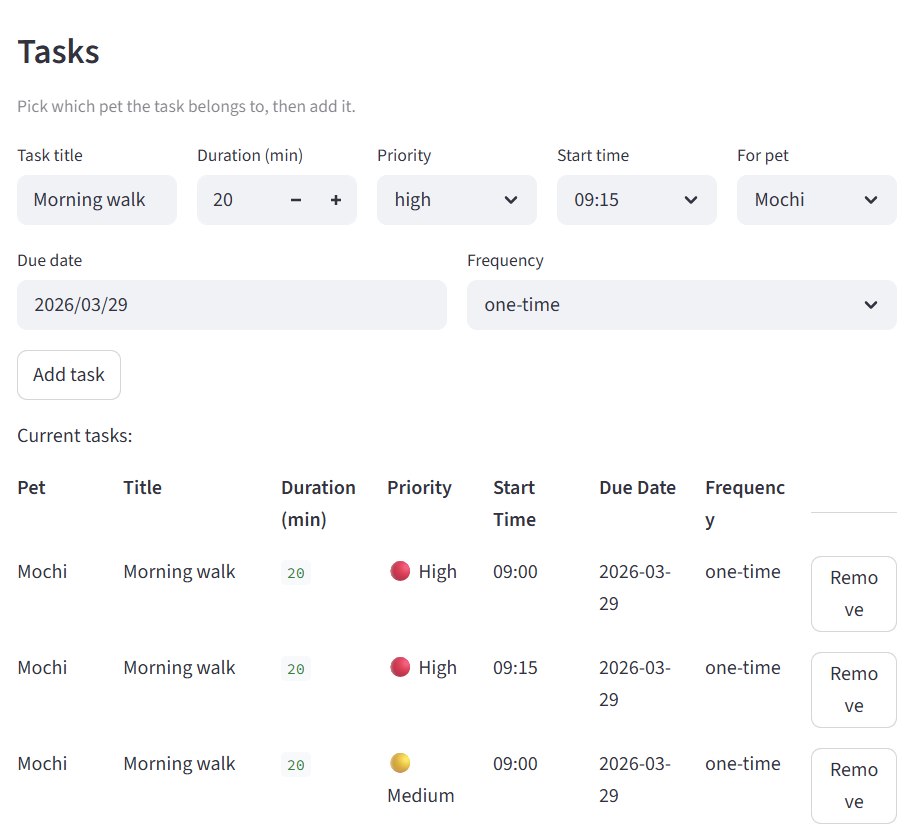
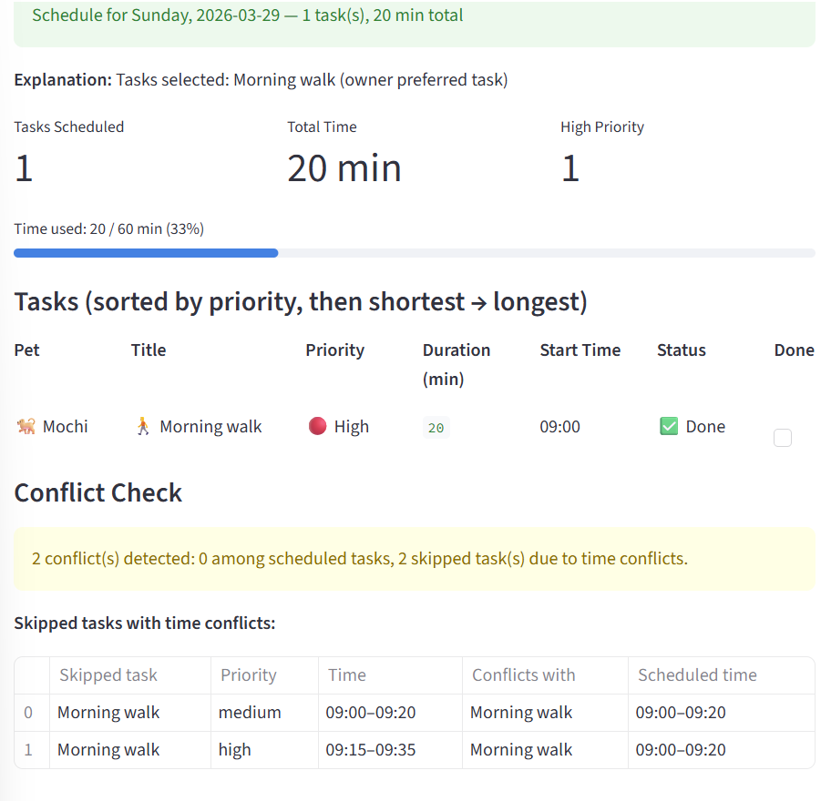

# PawPal+ (Module 2 Project)

You are building **PawPal+**, a Streamlit app that helps a pet owner plan care tasks for their pet.

## Scenario

A busy pet owner needs help staying consistent with pet care. They want an assistant that can:

- Track pet care tasks (walks, feeding, meds, enrichment, grooming, etc.)
- Consider constraints (time available, priority, owner preferences)
- Produce a daily plan and explain why it chose that plan

Your job is to design the system first (UML), then implement the logic in Python, then connect it to the Streamlit UI.

## What you will build

Your final app should:

- Let a user enter basic owner + pet info
- Let a user add/edit tasks (duration + priority at minimum)
- Generate a daily schedule/plan based on constraints and priorities
- Display the plan clearly (and ideally explain the reasoning)
- Include tests for the most important scheduling behaviors

## Getting started

### Setup

```bash
python -m venv .venv
source .venv/bin/activate  # Windows: .venv\Scripts\activate
pip install -r requirements.txt
```

### Suggested workflow

1. Read the scenario carefully and identify requirements and edge cases.
2. Draft a UML diagram (classes, attributes, methods, relationships).
3. Convert UML into Python class stubs (no logic yet).
4. Implement scheduling logic in small increments.
5. Add tests to verify key behaviors.
6. Connect your logic to the Streamlit UI in `app.py`.
7. Refine UML so it matches what you actually built.

### Smarter Scheduling
1. Schedule tasks based on time availability, task priority, and owner preferences.
2. Sorting by task duration time
3. Filtering by pet and task status
4. Automate recurring tasks
5. Warning when task conflicts

### Testing PawPaw+
run tests:
```bash
python -m pytest
```

1. test_sort_by_time_orders_shortest_first: 
 Adds tasks out-of-order, confirms sort_by_time produces ascending duration_minutes
2. test_daily_recurring_task_creates_next_day_occurrence: 
 Calls pet.complete_task(), verifies original is marked done and a new task appears with due_date + 1 day
3. test_non_recurring_task_does_not_spawn_next_occurrence: 
 Completing a task with no frequency should not grow the task list
4. test_conflict_detected_for_same_start_time: 
 Two tasks at 09:00 — detect_conflicts must return an "overlaps" warning
5. test_conflict_detected_when_task_outside_available_slot: 
 Task at 14:00 vs slot 09:00–09:30 — must return a "does not fit" warning
6. test_pet_with_no_tasks_produces_empty_schedule: 
 Edge case: empty task list → total_time == 0, no crash

 ### Confidence Level
 5

### Features

**Task Management**
- Add, remove, and update tasks with title, duration, priority, and optional start time
- Mark tasks as complete
- Parse start times from multiple formats (`9:00AM`, `09:00`, `14:50`)

**Recurring Tasks**
- Daily recurrence: a task repeats every day from its due date onward
- Weekly recurrence: a task repeats on the same weekday each week
- Completing a recurring task automatically enqueues the next occurrence with the correct due date

**Smart Schedule Generation**
- Selects tasks greedily by priority (`high > medium > low`), then by owner preferences, then by earliest start time
- Skips tasks that exceed remaining available time
- Skips tasks whose time windows overlap already-selected timed tasks
- Produces a plain-English explanation of why each task was chosen

**Sorting**
- Sort selected schedule tasks by duration (shortest first)

**Filtering**
- Filter schedule tasks by completion status (`completed=True/False`)
- Filter schedule tasks by pet name

**Conflict Detection**
- Overlap warning: flags any two scheduled tasks whose time windows intersect
- Overrun warning: flags any task that does not fall entirely within an owner's declared availability slot

**Owner & Pet Profiles**
- Owner stores available time slots and preferences (preferred task types, preferred pets)
- Multiple pets per owner, each with their own independent task list

### Demo


### Challenge 3

Because I have implemented the priority and a specific rules for the order of tasks, I just update the tasks table in app.py. Now the tasks will show tasks sorted by priority first, then by time, and the emojis will appear before the priority.

### Challenge 4

To make the app more user-friendly, I added visual enhancements across both the Tasks and Schedule sections:

1. **Task-type emojis** — A helper function `task_emoji()` maps keywords in the task title to an emoji (🚶 walk/run, 🍽️ feed/meal, 💊 meds, ✂️ groom, 🎾 play, 📋 default). The emoji is prefixed to the Title column in both the current tasks table and the schedule table.

2. **Species emojis** — A helper function `species_emoji()` shows 🐕 for dogs, 🐈 for cats, and 🐾 for others. Applied to the Pet column in both tables.

3. **Completion status indicator** — The schedule table now includes a Status column showing ✅ Done or ⏳ Pending alongside the existing Done checkbox.

4. **Schedule metric cards** — After the schedule is generated, three `st.metric()` cards display at a glance: Tasks Scheduled, Total Time (min), and High Priority task count.

5. **Progress bar** — An `st.progress()` bar shows how much of the owner's available time the generated schedule fills, with a label showing exact minutes and percentage (e.g. `Time used: 45 / 60 min (75%)`).

